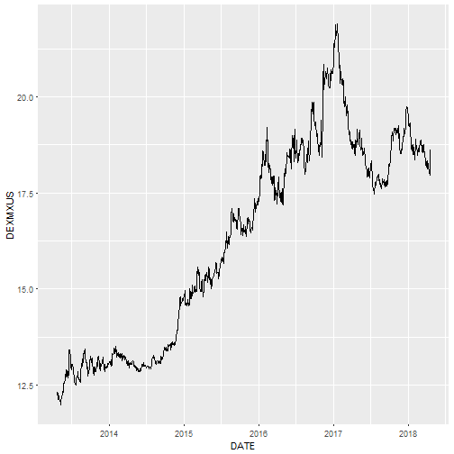

MXN
========================================================
author: Pablo Rodriguez
date: April 30, 2018
autosize: true

Intro
========================================================


This is a simple test of the functionality offered by the plotly library.

The data was downloades from St. Louis Fed website : https://fred.stlouisfed.org/series/DEXMXUS


```r
library(dplyr)
library(ggplot2)
library(plotly)
library(lubridate)
library(htmltools)
```


Loading and Cleaning
========================================================


Load the data, and a little preprocessing.


```r
setwd("C:/Users/Pablo/Dropbox/DataProducts/week3")
prices<-read.csv("DEXMXUS.csv", header=TRUE,stringsAsFactors = FALSE)

prices<-prices[complete.cases(prices),]
prices$DATE<-ymd(prices$DATE)
prices$DEXMXUS<-as.numeric(prices$DEXMXUS)
prices<-prices[complete.cases(prices),]
```
Default Plotly
========================================================
USD MXN time series


<iframe src="demo.html" style="position:absolute;height:80%;width:80%"></iframe>

Plain Vanilla ggplot
========================================================
USD MXN time series




Plain Vanilla ggplot
========================================================
USD MXN time series


<iframe src="demo2.html" style="position:absolute;height:80%;width:80%"></iframe>
